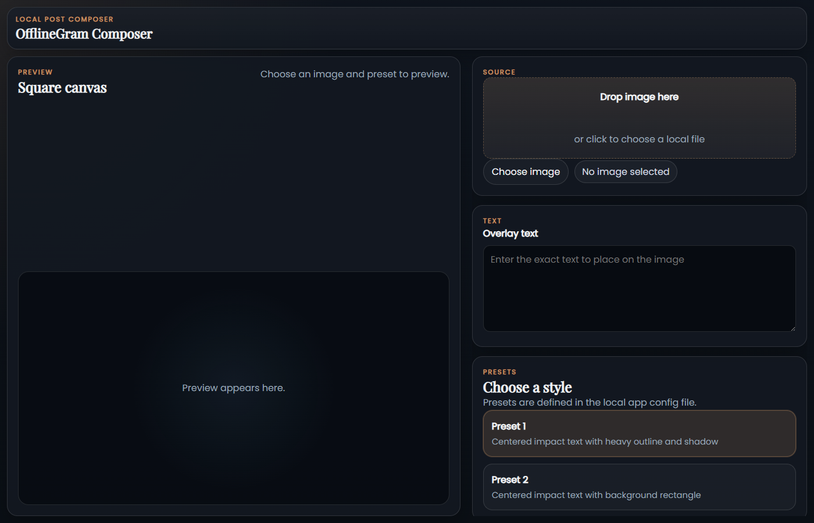
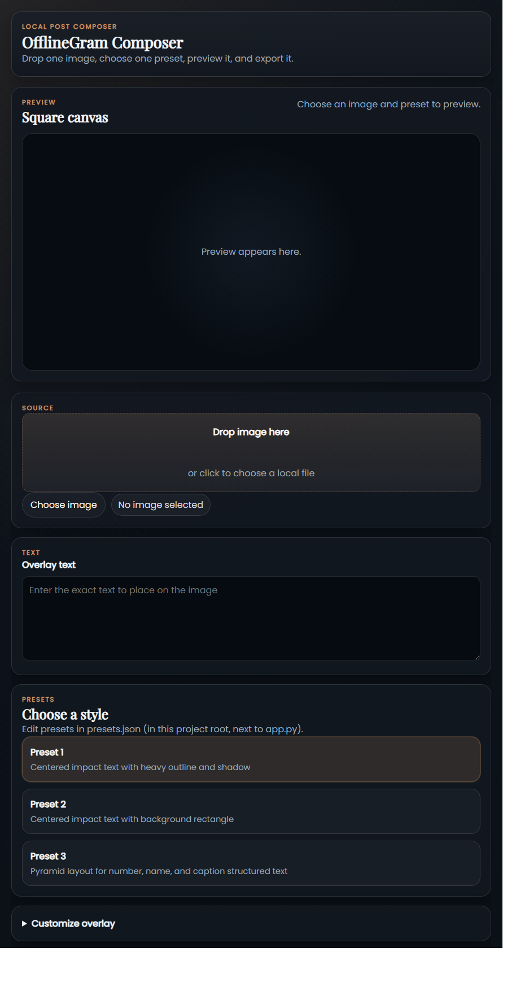
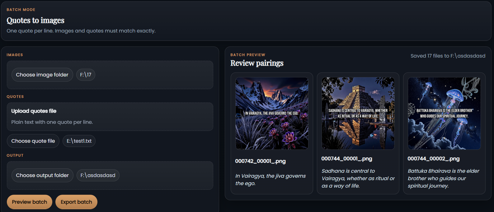
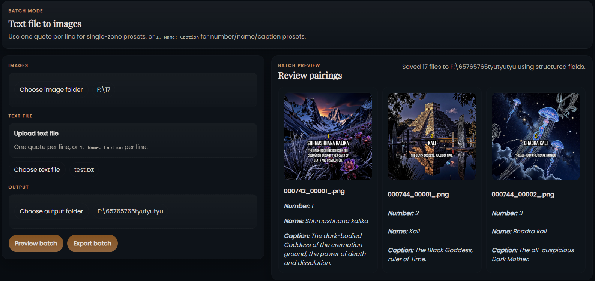

# OfflineGram Composer

**Create offline quote images and square social media posts in your browser.**

**[Project site -> 09ashishkapoor.github.io/offlinegram-composer](https://09ashishkapoor.github.io/offlinegram-composer/)**

**[Roadmap -> docs/ROADMAP.md](docs/ROADMAP.md)**

OfflineGram Composer is a simple tool for turning local images and text into ready-to-export quote graphics and square posts. Choose an image, add your text, pick a style preset, preview the result, and export a PNG without relying on cloud tools, accounts, or online editors.



## What You Can Do

- Make quote images from local files
- Create square posts for Instagram-style layouts
- Batch-create multiple images from a text file
- Pick a preset, preview the result, and export PNGs
- Keep the full workflow offline on your own machine

## Quick start

**Requirements:** Python 3.11 recommended (3.9+ supported), any modern browser.

```bat
setup.bat
launch.bat
```

Then open **http://127.0.0.1:8000** in your browser.

`setup.bat` creates a virtual environment and installs all dependencies automatically. It prefers Python 3.11 for best `skia-python` compatibility.

## Features

- Drag and drop an image or choose one from disk
- Native Windows file/folder picker for **Choose image**, **Choose quote file**, and **Choose output folder**
- Add overlay text and preview the result live
- Apply one-click presets loaded from the root `presets.json` config
- Export a finished PNG to any local folder
- Batch-create multiple images from a one-quote-per-line text file or a structured preset-driven multi-zone text file
- Review sample image and quote pairings before exporting a full batch
- Open advanced per-zone controls with **Customize overlay**
- Stay fully offline with no accounts, no cloud, and no telemetry

## Screenshots

### Main interface



*Left: live preview canvas. Right: source, text, preset, and export controls.*

### Batch mode



*Pick an image folder, upload or choose a quotes file, preview sample pairings, then export the whole batch with the active preset.*

### Batch mode with preset 3



*`preset_3` uses a structured batch file so one line can populate the number, name, and caption zones on each image.*

## Workflow

1. Drop or choose an image in **Source**
2. Type your overlay text in **Text**
3. Click a preset under **Choose a style**
4. Click **Preview** to see the result
5. Click **Export PNG** to save to your chosen output folder

On Windows, the **Choose ...** buttons open native system dialogs. If native dialogs are unavailable in the current runtime, the app automatically falls back to the built-in browser picker.

## Batch mode

Use **Quotes to images** when you want to process a whole folder in one pass.

1. Click **Choose image folder** and select the source folder
2. Upload a plain text file, or use **Choose text file**
3. Select the preset you want to apply to the whole batch
4. Click **Choose output folder**
5. Click **Preview batch** to render sample image/quote pairings
6. Click **Export batch** to save all PNGs

The selected preset controls how batch text is parsed. The preset definitions live in the project root in `presets.json`, and those root preset configs are the source of truth for batch mode. Use or edit `presets.json` when you want to change layout, field mapping, or text-zone behavior.

Batch mode supports two preset-driven text-file formats:

- **Single-zone presets** (`preset_1`, `preset_2`): one quote per non-empty line
- **Structured presets** (`preset_3` or your own presets using `text_source` values like `number`, `name`, and `caption`): one entry per non-empty line in the form `1. Name: Caption`

In structured mode, the text before the first `.` becomes the **number**, the text between `.` and `:` becomes the **name**, and the text after `:` becomes the **caption**. The default `preset_3` stacks those three zones vertically in a pyramid-style layout, and you can move them by editing the root `presets.json`.

Example:

```text
1. Shhmashhana kalika: The dark-bodied Goddess of the cremation ground, the power of death and dissolution.
2. Kali: The Black Goddess, ruler of Time.
3. Bhadra kali: The all-auspicious Dark Mother.
```

See [`sample_file_Preset3.txt`](sample_file_Preset3.txt) for a longer structured batch example for `preset_3`.

Batch exports still require exact pairing counts:

- single-zone mode: quote count must match image count
- structured mode: structured entry count must match image count

## Customising presets

Open `presets.json` in the project root and edit or add entries. This is the preset file the app actually loads at runtime, and it should be the file you use for preset changes. Each preset defines one or more *zones* - text blocks, bands, or shapes - with full control over font, size, color, opacity, position, shadow, and outline.

Restart the app after saving changes; the preset list reloads on the next page load.

## Advanced overlay controls

Click **Customize overlay** in the control panel to expose per-zone settings without editing JSON - useful for one-off tweaks before export.

## Stack

| Layer | Library |
|---|---|
| Backend | FastAPI + Uvicorn |
| Image rendering | skia-python |
| Image loading | Pillow |
| Frontend | Vanilla HTML / CSS / JS |
| Tests | pytest + FastAPI TestClient |

## Running tests

```powershell
venv\Scripts\python -m pytest -v
```

## Project structure

```text
app.py            FastAPI application and route handlers
processor.py      Skia rendering engine and file utilities
presets.py        Preset loading and zone resolution
presets.json      Editable preset definitions
setup.bat         One-time environment setup
launch.bat        Start the local server
templates/        HTML template
static/           CSS, JS, screenshots
fonts/            Bundled font files
tests/            pytest test suite
```

## Structured batch presets

The former roadmap item for multi-zone batch text files is now implemented.

- `preset_3` is the built-in example for structured batch rendering
- custom structured presets can use `text_source` values such as `number`, `name`, `caption`, `title`, and `subtitle`
- the preset definitions for that behavior live in the root `presets.json`

---

## GitHub Pages site

Live at **https://09ashishkapoor.github.io/offlinegram-composer/**

The source is in the `docs/` folder, served via GitHub Pages (Settings -> Pages -> branch `main`, folder `/docs`).

The site homepage now includes a roadmap spotlight near the top, and the full roadmap lives at [`docs/ROADMAP.md`](docs/ROADMAP.md).

---

## License

MIT - see [LICENSE](LICENSE).
